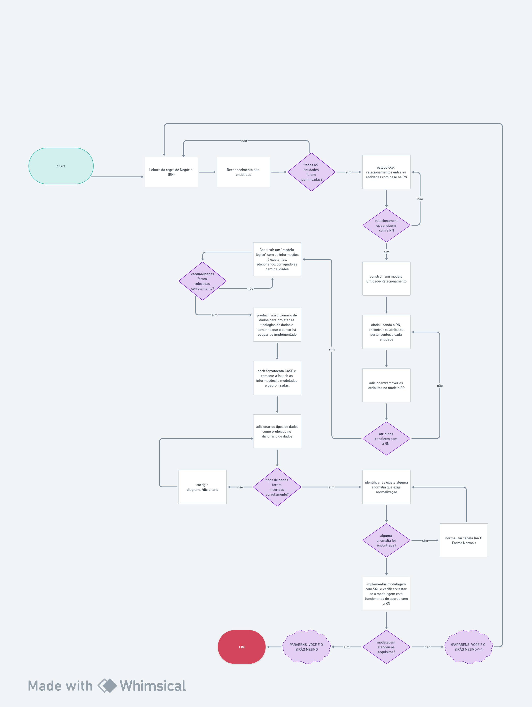
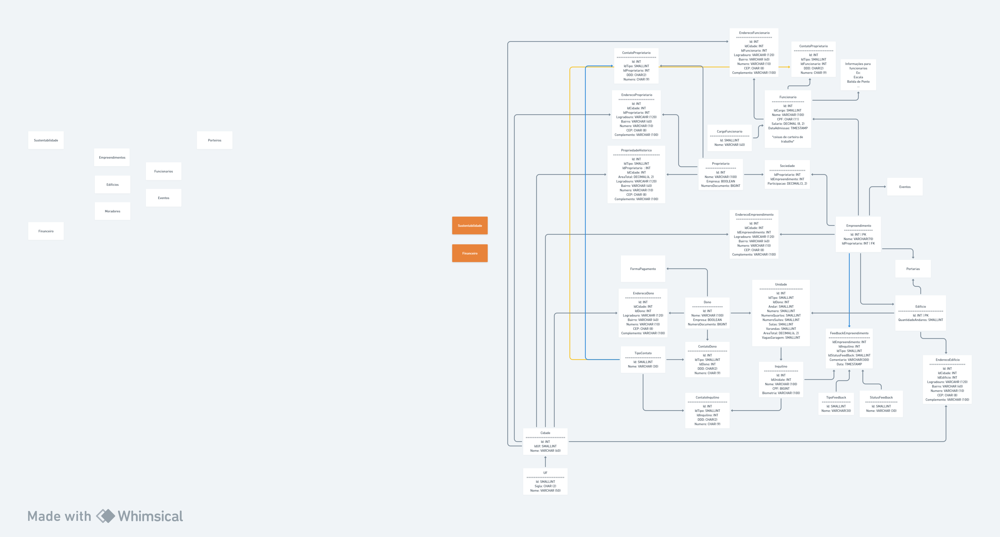
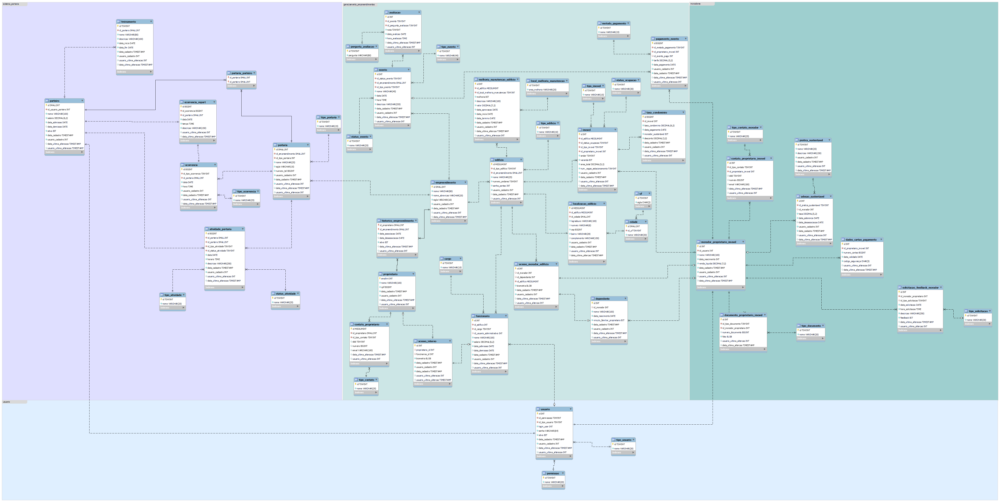
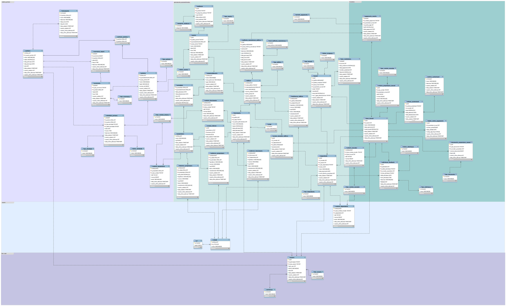

# atividade-revisao-smn

Para responder a esta atividade, crie um repositório no GitHub onde, para cada questão, deverá haver um commit.
Modelagem de base:

https://whimsical.com/immolink-P5p45HJ2cSbVxsb5F5tKfB

1- Cite qual é a utilidade de cada um dos pilares do pensamento computacional e como podem ser usados em problemas reais não relacionados a computadores.

Existem 4 pilares no pensamento computacional. Ao se deparar com um problema complexo, o pensamento computacional se inicia na decomposição desse problema em partes menores e mais palpáveis, de modo que o problema esteja fragmentado e, agora, possa ser enxergado em várias perspectivas mais simples.

Seguindo essa linha de raciocínio, o próximo pilar do pensamento computacional diz respeito ao reconhecimento de padrões. Agora, perceba que esses padrões podem se repetir dentro das partes já fragmentadas relacionadas à decomposição do problema. Nesse sentido, o reconhecimento de padrões é um pilar essencial para que o próximo pilar seja aplicado, pois ao verificar padrões que se repetem, podemos abstrair daquele mesmo contexto uma solução simples para os demais contextos nos quais identificamos padrões semelhantes.

Dessa forma, com a decomposição do problema e identificação de padrões relacionados à solução desse problema, podemos, agora, abstrair do objeto de estudo em soluções que podem ser comuns e reutilizáveis, tanto para a compreensão como para a efetiva resolução do desafio posto. Se imaginarmos a construção de uma aplicação que se utiliza de uma classe abstrata "funcionário" que irá abrigar todos os atributos comuns a todos os funcionários, mas no futuro alguns funcionários podem ter características únicas. Contudo, haveria a reutilização de código justamente pela herança de classes mais especializadas de funcionários em detrimento da classe abstrata.

Consequentemente, após esses 3 pilares serem enfrentados, perceba que eles projetam mais do que executam. Isso pode ser analisado ao observarmos que o último pilar, que seria da construção de algoritmos, entrará em voga. Então, ao iniciar o algoritmo, o qual, no sentido do exemplo dado, iria se referenciar à escrita de código, se tornará muito mais intuitiva e dinâmica, pois ao se utilizar os 3 pilares de forma correta, o projeto do algoritmo para resolução do problema complexo passado já estará mais compreensível no sentido de execução das instruções para solucionar o problema.

Olhando para um problema que não esteja relacionado aos computadores, o pensamento computacional pode ser usado na produção de uma receita de confeitaria que exige maior precisão nos ingredientes, por exemplo. Ao analisar um bolo para que sua receita seja produzida, é necessário decompor o processo de produção em etapas separadas: seleção de ingredientes e modo de preparo. Dessa forma, ao selecionar os ingredientes, podem ser procurados padrões que se repetem na maioria das produções de confeitaria relacionadas a bolos, assim como a forma mais correta de preparo. Obtendo essas informações, pode-se, na descrição da receita, abstrair esses dados para ingredientes e modo de preparo comuns ao processo de preparo padrão. A parte que diferenciará esse preparo dos demais será apresentada pelo algoritmo construído (receita final). Tendo isso em mente, o algoritmo da receita utilizará a abstração existente para a produção de um bolo padrão, semelhante a uma classe abstrata em POO. Em seguida, o próprio algoritmo conduzirá a finalização da receita com base no que se exige da visualização do bolo finaliza

2- Com suas palavras, explique a importância de seguir as regras normais no desenvolvimento de uma modelagem de dados.

No desenvolvimento de uma modelagem de dados, é necessário fazer algumas considerações relacionadas à normalização dos dados. Nesse contexto, a 1ª forma normal diz respeito à eleição de possíveis chaves candidatas para que essa torne aquele registro na tabela único. Em relação às possíveis chaves, podem ser escolhidas chaves mais orgânicas como CPF e alguns outros atributos eleitos a chave que poderiam cumprir a função principal. Como uma forma de padronização, na SMN, é preferível utilizar uma chave surrogada que se refere a um ID de autoincremento. Desse modo, todos os registros terão sua unicidade garantida pela chave surrogada.

Na segunda forma normal, percebe-se que, como as tabelas já possuem suas primary keys, é possível que relacionamentos entre as tabelas sejam feitos. Dessa forma, os atributos não chave que estejam parcialmente dependentes de outros atributos não chaves devem ser questionados se eles fazem parte daquela tabela ou se, ainda, existe a possibilidade de encontrar uma nova entidade dentro dessa tabela, uma vez que, se forem encontradas muitas dependências desses atributos não chaves para outro atributo que também não é chave. Provavelmente, será recomendada a construção de uma nova tabela com base nesses atributos, e um relacionamento com chave estrangeira pode ser feito de modo que a integridade e o relacionamento entre as tabelas permaneçam.

Na terceira forma normal, é preciso identificar se existem dependências transitivas entre os atributos da minha tabela com relação a uma chave primária composta. Um exemplo perceptível disso é na criação de tabelas intermediárias de muitos para muitos. Geralmente, a chave primária dela é composta pelas n chaves estrangeiras da associação muitos para muitos, e é feita uma tabela associativa. Agora, para completar o exemplo, imagine que essa tabela associativa foi incrementada com alguns atributos que são dependentes da primeira parte da chave composta, e os demais dizem respeito à segunda, e ainda, pode ser imaginado que existe um único atributo que diz respeito às duas. Esse atributo será o único que não irá possuir uma dependência transitiva, mas, para entrar na terceira forma normal, é preciso que seja criada uma chave surrogada, ou no pior dos cenários, normalizar essa situação separando as chaves em novas entidades as quais possuam atributos que sejam funcionalmente dependentes da chave primária.

Considerações: Apesar de a normalização ser sempre bem vista para deixar a modelagem mais robusta, é necessário ter em mente que alguns aspectos podem pesar na hora de se utilizar uma normalização muito engessada e rigorosa, principalmente quando se começa a confeccionar consultas, pois, devido à normalização, alguns dados para sempre agrupados em apenas uma consulta podem levar muitos INNER JOINS, o que pode deixar a consulta mais lenta ou cara, dependendo da quantidade de dados e do banco que se esteja utilizando. Desse modo, existem módulos de estudos sobre desnormalização de dados para que se tenha consultas mais fáceis e precisas a serem retornadas. Resumindo, é necessário achar o meio termo, pois tudo "DEPENDE"
    

3- Crie um fluxograma para a criação de modelagem.

Segue modelagem referente ao processo de criação de uma modelagem de dados. 

https://whimsical.com/questao-3-Upxdxp7xwncvHTskkgt923
     

 

4- Sobre a modelagem feita por Ianko para a ImmoLink, quais são as divergências em relação ao seu pensamento, seja em tipagem, nomenclatura, tabelas, etc.

Em relação á modelagem de Ianko alguns pontos de divergência na minha modelagem ficaram em destaque:
1. Como algumas nomenclaturas de tabelas e criação de tabelas de endereço para as entidades principais já que na minha forma de pensar, ao ler a regra de negócio, não havia    indicativos. 
2. Além disso, alguns atributos para controle como manutes e outras tabelas adicionais conforme pedia a regra de negócio da immoLink foram adicionadas. O principal ponto de divergÊncia da minha modelagem para de Ianko foi mais as questões de endereço das entidades mais fortes e a tabela de histórico de propriedades que não foi feita na minha modelagem. 
3.  Outro ponto, também, foi a questão dos inquilinos que na minha modelagem eles foram vistos como dependêntes já que, caso o proprietário também seja o morador, a tabela de dependentes irá representar os dependêntes como possíveis familiáres do proprietário e, caso esse proprietário não seja morador, a tabela de dependentes também irá representar esses inquilinos.  
4. referente a tipagem de dados em algumas tabelas utilizei tipo de dados inteiro para chaves surragadas mais condizentes com a realidades EX: na tabela tipo_contato de Ianko o dado está como smallint, e a minha está como tinyint. 

As demais divergências poderão ser visualizadas abaixo: 

<table>
  <tr>
    <td></td>
    <td></td>
  </tr>
</table>

5- Crie sua modelagem com base na incompleta de Ianko, utilizando as alterações que desejar e finalize os módulos que ele não terminou.

Segue correção da minha modelagem com base na modelagem feita por Ianko. 

